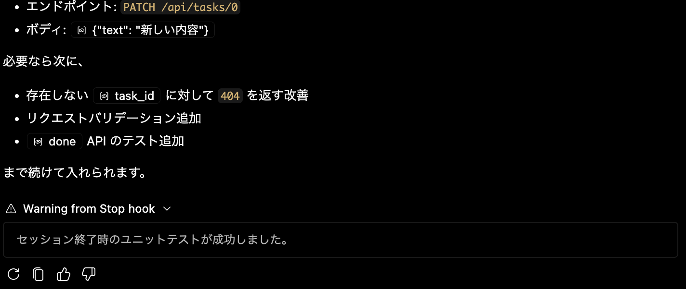

# hook の動作テスト

hookは以下のチャットで作成した

```
/create-hook セッション終了時にユニットテストを行うように設定して。ユニットテストを行うスクリプトは、scripts/agent_stop_hook.sh に定義して、それを呼び出す形に設定して
```

[scripts/agent_stop_hook.sh](scripts/agent_stop_hook.sh) を見ると、ちゃんとJSON応答の仕様に従って応答していて良さそうである。

難しいので指示して作ってもらうと良さそう。

実際に実行する `/do` と、実行される

チャット欄に"Waning from Stop Hook"として、「セッション終了時のユニットテストが成功しました。」と表示されている。


